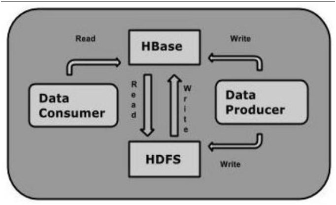

# BDA

## Hadoop

### History of Hadoop

    `Hadoop originated from Google's MapReduce and Google File System (GFS) papers (2003-2004). Doug Cutting and Mike Cafarella created Hadoop in 2005, naming it after Cutting's son's toy elephant.
    Hadoop's history began with Google's publication of two research papers:

    - 2003: Google File System (GFS) paper
    - 2004: MapReduce paper

    Inspired by these papers, Doug Cutting and Mike Cafarella created Hadoop in 2005. Cutting named the project after his son's toy elephant.

    Key milestones:

    - 2006: Hadoop becomes an Apache project
    - 2008: Hadoop 0.18 released
    - 2012: Hadoop 1.0 released

### What is hadoop?

    Hadoop is an open-source, distributed computing framework for storing and processing large datasets.
    Key features:

    - Scalability
    - Flexibility
    - Fault tolerance
    - Cost-effectiveness

### Hadoop Framework Modules?

    Hadoop framework consists of:
      - Common (utilities)
        - Provides libraries and utilities for tasks like file handling, networking, and compression.
        - Acts as a foundation for other Hadoop components.

      - HDFS (Hadoop Distributed File System)
        - A distributed storage system that splits data into smaller chunks (blocks) and stores them across multiple machines.
        - Allows for scalable and fault-tolerant data storage
      
      - YARN (Yet Another Resource Negotiator)
        - Manages resources (like memory and CPU) across the Hadoop cluster.
        - Enables multiple data processing frameworks (like MapReduce, Spark, and Flink) to run on the same cluster.

      - MapReduce (processing)
        - A programming model and framework for processing large datasets in parallel.
        - Breaks down complex tasks into smaller, manageable chunks (maps and reduces) that can be executed across the cluster.

### Why was Hadoop needed?

        Hadoop was needed to store and process exponentially growing datasets, handle various data types, and provide faster processing.

### Hadoop Vendors

        Key Hadoop vendors:

        - Apache
        - Cloudera
        - Hortonworks
        - MapR
        - IBM
        - Microsoft

### Hadoop Distributed File System(HDFS)

    HDFS is a distributed storage system for large datasets, providing scalability and fault tolerance.

### How Hadoop fixes problems

    Hadoop addresses:

    - Storing exponentially growing datasets: scalable storage
    - Storing different types of data: flexible data handling
    - Processing data faster: parallel processing

### Hadoop Architecture

    

     Master-Slave Architecture in Hadoop

    (Mind Map)

        Hadoop Cluster
        |- NameNode (Master)
            |- DataNodes (Slaves)
        |- JobTracker (Master)
            |- TaskTrackers (Slaves)

### Hadoop Ecosystem

    

        Hadoop ecosystem includes tools and technologies that integrate with Hadoop for data processing, analytics, and management.

      1. HDFS: Distributed storage: Stores data across multiple machines for scalability. Provides fault-tolerant data storage.

      2. YARN: Resource management: Manages resources like memory and CPU across the cluster. Enables multiple processing frameworks.

      3. MapReduce: Processing: Processes large datasets in parallel using maps and reduces. Scalable and fault-tolerant.

      4. Spark: In-memory processing: Performs fast in-memory processing for big data analytics. Supports multiple programming languages.

      5. Pig: Data processing language: Simplifies data processing using Pig Latin scripting language. Ideal for ad-hoc data analysis.

      6. Hive: Data warehousing: Provides data warehousing and SQL-like querying for big data. Simplifies data analysis and reporting.

      7. HBase: NoSQL database: Offers NoSQL database capabilities for big data storage. Provides real-time data access.

      8. Mahout: Machine learning: Enables scalable machine learning for big data analytics. Supports various algorithms.

      9. Spark MLib: Machine learning: Provides scalable machine learning library for Spark. Supports various algorithms.

      10. Apache Drill: SQL query engine: Allows SQL querying on big data sources like HDFS and NoSQL databases. Provides real-time data access.

      11. Zookeeper: Configuration management: Manages configuration and coordination across distributed systems. Ensures data consistency.

      12. Oozie: Workflow management: Manages workflow orchestration for big data processing. Supports various processing frameworks.

      13. Flume: Data ingestion: Ingests data from various sources into HDFS or other storage systems. Provides reliable data ingestion.

      14. Sqoop: Data transfer: Transfers data between HDFS and relational databases. Supports batch and incremental data transfer.

      15. Solr: Search engine: Provides scalable search engine capabilities for big data. Supports faceted search and filtering.

      16. Lucene: Search library: Offers scalable search library capabilities for big data. Supports indexing and querying.

      17. Ambari: Cluster management: Manages Hadoop cluster provisioning, monitoring, and management. Simplifies cluster administration.

## FS

    Traditional File System

    A traditional file system is a hierarchical storage system that allows you to store, retrieve, and manage files and directories on a single machine or a network of machines. Examples of traditional file systems include NTFS, HFS, and ext4.

    Characteristics

    - Hierarchical directory structure
    - Files are stored in a single location
    - Limited scalability
    - Prone to single-point failures

    

### HDFS

    HDFS (Hadoop Distributed File System)

    HDFS is a distributed file system designed to store large amounts of data across a cluster of machines. It's a key component of the Hadoop ecosystem.

    Characteristics

    - Distributed storage across multiple machines
    - Scalable and fault-tolerant
    - Designed for high-throughput access
    - Optimized for batch processing and large-scale data analytics

    Key Differences b/w FS and HDFS

    1. Scalability: HDFS is designed to scale horizontally, adding more nodes to the cluster as needed. Traditional file systems are limited to a single machine or a small network.
    2. Fault Tolerance: HDFS replicates data across multiple nodes to ensure availability in case of node failures. Traditional file systems are prone to single-point failures.
    3. Data Distribution: HDFS stores data in a distributed manner across multiple nodes, while traditional file systems store data in a single location.
    4. Access Patterns: HDFS is optimized for high-throughput access, while traditional file systems are optimized for low-latency access.
    5. Data Size: HDFS is designed to handle large amounts of data, while traditional file systems are suitable for smaller datasets.

    In summary, HDFS is a distributed file system designed for large-scale data storage and processing, while traditional file systems are suitable for smaller-scale data storage and retrieval.

    

### HDFS Architecture

    

    HDFS Components

    1. NameNode (NN): The master node that maintains metadata about the cluster, such as file locations and block replicas.
    2. DataNode (DN): Slave nodes that store data blocks and provide data access.
    3. Client: The application that accesses the HDFS cluster.

    HDFS Architecture Diagram

    +---------------+
    |    Client     |
    +---------------+
            |
            |
            v
    +---------------+
    |    NameNode   |
    |   (Metadata)  |
    +---------------+
            |
            |
            v
    +---------------+---------------+
    |     DataNode  |     DataNode  | ...
    |   ( Block 1 ) |   ( Block 2 ) |
    +---------------+---------------+

    HDFS Data Flow

    1. File Splitting: The client splits the file into fixed-size blocks (typically 128 MB).
    2. Block Replication: The client sends the blocks to the NameNode, which replicates each block across multiple DataNodes (typically 3).
    3. Metadata Storage: The NameNode stores metadata about the file, including block locations and replication information.
    4. Data Retrieval: When the client requests a file, the NameNode provides the block locations, and the client retrieves the blocks directly from the DataNodes.

    HDFS Features

    1. Scalability: HDFS can scale horizontally by adding more DataNodes.
    2. Fault Tolerance: HDFS replicates data across multiple DataNodes to ensure availability in case of node failures.
    3. High Throughput: HDFS optimizes data transfer by using a pipeline of DataNodes to transfer data in parallel.

    HMaster
    Overview
    HMaster is the central component of HBase, responsible for managing the cluster, handling schema changes, and maintaining the global state of the cluster.

    Main Components
    1. Master Interface: Handles client requests for schema changes, table creation, and other administrative tasks.
    2. Assignment Manager: Responsible for assigning regions to RegionServers and managing region transitions.
    3. RegionServer Tracker: Tracks the status of RegionServers and handles failovers.
    4. TableStateManager: Manages the state of tables, including schema changes and table creation.

    # RegionServer
    Overview
    RegionServer is responsible for storing and managing data in HBase, handling client requests for data access and modification.

    Main Components
    5. Region: A contiguous range of rows in a table, stored on a single RegionServer.
    6. MemStore: An in-memory store for data, used for caching and buffering writes.
    7. StoreFiles: Files stored on disk, containing data for a region.
    8. RegionScanner: Handles client requests for data access, scanning regions for matching data.
    9. HFile: A file format used for storing data in StoreFiles.

    Key differences:

    - HMaster focuses on cluster management and schema changes, while RegionServer focuses on data storage and access.
    - HMaster is a single point of failure, while RegionServers are designed for horizontal scaling and failover.

### HDFS Blocks

    HDFS Block

    - An HDFS block is the smallest unit of data storage in HDFS.
    - Each block is typically 128 MB or 256 MB in size (configurable).
    - When a file is written to HDFS, it's broken into blocks, and each block is stored on a different node in the cluster.
    - Each block is replicated across multiple nodes (typically 3) for fault tolerance and availability.

### Hadoop Cluster

    Hadoop Cluster

    - A Hadoop cluster is a group of computers (nodes) working together to store and process large datasets.
    - A typical Hadoop cluster consists of:
        - NameNode (NN): The master node that maintains metadata about the cluster, such as file locations and block replicas.
        - DataNodes (DN): Slave nodes that store data blocks and provide data access.
        - Resource Manager (RM): Manages resources and schedules jobs (applications) on the cluster.
        - Node Manager (NM): Runs on each node and manages resources and job execution.
        - Client Node: Submits jobs and accesses data on the cluster.
    - Hadoop clusters can be deployed in various modes, including:
        - Standalone mode: A single node runs all Hadoop components.
        - Pseudo-distributed mode: A single node runs multiple Hadoop components.
        - Fully distributed mode: Multiple nodes form a cluster, with each node running one or more Hadoop components.

### HDFS Write Mechanism

    1. Client Request: A client requests to write data to HDFS.
    2. NameNode Allocation: The client contacts the NameNode to allocate a block for the data.
    3. Block Creation: The NameNode creates a new block and returns the block ID and a list of DataNodes to store the block.
    4. Data Transfer: The client splits the data into packets and transfers them to the first DataNode in the list.
    5. Pipeline Creation: The first DataNode creates a pipeline to the next DataNode, and so on, until the last DataNode.
    6. Data Replication: Each DataNode in the pipeline writes the data to its local storage and replicates it to the next DataNode.
    7. Acknowledgement: Each DataNode sends an acknowledgement to the client after writing the data.
    8. Block Confirmation: The client confirms the block write with the NameNode.

### HDFS Read Mechanism

    1. Client Request: A client requests to read data from HDFS.
    2. NameNode Lookup: The client contacts the NameNode to get the block locations for the requested data.
    3. Block Location: The NameNode returns the block locations, including the DataNodes that store the block replicas.
    4. DataNode Selection: The client selects the closest DataNode that stores the block replica.
    5. Data Transfer: The client requests the data from the selected DataNode, and the DataNode transfers the data to the client.
    6. Data Verification: The client verifies the data integrity using checksums.
    7. Block Caching: The client can cache the block data for future reads.

#### Key Components

    - NameNode: Maintains metadata about the HDFS namespace, including block locations and replication information.
    - DataNode: Stores data blocks and provides data access.
    - Block: A fixed-size chunk of data (typically 128 MB) that is stored and replicated across DataNodes.

    Benefits

    - Scalability: HDFS can scale horizontally by adding more DataNodes.
    - Fault Tolerance: HDFS replicates data across multiple DataNodes to ensure availability in case of node failures.
    - High Throughput: HDFS optimizes data transfer by using a pipeline of DataNodes to transfer data in parallel.

### Control and Data Flow Summary

    Control Flow

    1. Client: Initiates read/write requests to HDFS.
    2. NameNode: Maintains metadata, allocates blocks, and directs clients to DataNodes.
    3. DataNode: Stores and retrieves data blocks.

    Data Flow

    4. Write:
        1. Client splits data into blocks.
        2. NameNode allocates blocks and directs client to DataNodes.
        3. Client writes data to first DataNode, which replicates to other DataNodes.
    5. Read:
        1. Client requests data from NameNode.
        2. NameNode directs client to nearest DataNode with requested block.
        3. Client reads data from DataNode.

    Key aspects:

    - Scalability: HDFS scales horizontally by adding DataNodes.
    - Fault Tolerance: Data replication ensures availability despite node failures.
    - High Throughput: Pipelined data transfer optimizes performance.

## Hadoop MapReduce

    What is Hadoop MapReduce?

    Hadoop MapReduce is a programming model and software framework used for processing large data sets in a distributed manner. It's a key component of the Apache Hadoop ecosystem.

    Hadoop MapReduce in a Nutshell

    MapReduce is a simple, yet powerful paradigm for processing large data sets. Here's a brief overview:

    - Map Phase: The input data is split into smaller chunks, and each chunk is processed by a mapper task. The mapper task applies a transformation function to the data, producing a set of key-value pairs.
    - Reduce Phase: The output from the mapper tasks is aggregated and grouped by key. The reducer task applies a reduction function to the grouped data, producing the final output.

    Advantages of MapReduce

    1. Scalability: MapReduce can handle large data sets by distributing the processing across a cluster of nodes.
    2. Flexibility: MapReduce allows developers to write custom mapper and reducer functions to process data in a variety of formats.
    3. Fault Tolerance: MapReduce can handle node failures during processing by re-executing failed tasks.

    Example of MapReduce

    Suppose we have a large log file containing website access data, and we want to count the number of accesses for each IP address. Here's a simple MapReduce example:

    Mapper (Map Phase):

    - Input: Log file entries (IP address, timestamp, etc.)
    - Output: Key-value pairs (IP address, 1)

    Reducer (Reduce Phase):

    - Input: Key-value pairs (IP address, 1)
    - Output: Key-value pairs (IP address, count)

    YARN Components

    YARN (Yet Another Resource Negotiator) is a resource management layer in Hadoop that manages resources and schedules jobs (including MapReduce jobs) on a Hadoop cluster. The main YARN components are:

    1. ResourceManager (RM): The central component that manages resources and schedules jobs.
    2. ApplicationMaster (AM): Responsible for managing the lifecycle of a job, including resource negotiation and task execution.
    3. NodeManager (NM): Manages resources and executes tasks on a single node.
    4. Container: A resource allocation (memory, CPU, etc.) on a node where tasks are executed.

    YARN with MapReduce

    When a MapReduce job is submitted to YARN, the following process occurs:

    1. Job Submission: The MapReduce job is submitted to the ResourceManager (RM).
    2. ApplicationMaster Launch: The RM launches the ApplicationMaster (AM) for the job.
    3. Resource Negotiation: The AM negotiates resources (containers) with the RM for the job.
    4. Task Execution: The AM executes MapReduce tasks (mapper and reducer tasks) within the allocated containers.
    5. Progress Tracking: The AM tracks the progress of the job and reports it to the RM.
    6. Job Completion: The AM notifies the RM when the job is complete.

    YARN Application Workflow

    Here's a high-level overview of the YARN application workflow:

    1. Client Submission: A client submits a job (e.g., MapReduce job) to the YARN cluster.
    2. ResourceManager: The ResourceManager (RM) receives the job submission and initializes the job.
    3. ApplicationMaster: The RM launches the ApplicationMaster (AM) for the job.
    4. Resource Negotiation: The AM negotiates resources (containers) with the RM for the job.
    5. Task Execution: The AM executes tasks (e.g., MapReduce tasks) within the allocated containers.
    6. Progress Tracking: The AM tracks the progress of the job and reports it to the RM.
    7. Job Completion: The AM notifies the RM when the job is complete.
    8. Cleanup: The RM and AM perform cleanup tasks, such as releasing resources and deleting temporary files.

### Comparison b/w Haddop SQL DB

    Hadoop

    - Definition: An open-source, distributed computing framework for processing large datasets.
    - Characteristics: Scalable, flexible, fault-tolerant, and cost-effective.
    - Data Model: Handles structured, semi-structured, and unstructured data.
    - Processing: Batch processing, MapReduce, and Spark.
    - Use Cases: Big data analytics, data warehousing, machine learning, and IoT data processing.

    SQL DB (Relational Database)

    - Definition: A database management system that stores data in tables with well-defined schemas.
    - Characteristics: Supports ACID transactions, uses SQL for querying, and ensures data consistency.
    - Data Model: Relational model, with tables, rows, and columns.
    - Processing: Transactional processing, ad-hoc querying, and reporting.
    - Use Cases: Transactional systems, complex querying, and ad-hoc reporting.

    Key Differences

    - Data Model: Hadoop handles various data formats, while SQL DB uses a relational model.
    - Scalability: Hadoop is designed for horizontal scaling, while SQL DB scales vertically.
    - Processing: Hadoop is optimized for batch processing, while SQL DB is optimized for transactional processing.
    - Data Consistency: SQL DB ensures strong data consistency, while Hadoop provides eventual consistency.

    Similarities

    - Data Storage: Both Hadoop and SQL DB store data in a structured format.
    - Data Retrieval: Both support data retrieval through querying.
    - High Performance: Both are designed for high-performance applications.

    When to Choose Hadoop

    - Handling large datasets (big data) is required.
    - Flexibility in data schema and format is necessary.
    - Batch processing and MapReduce are required.

    When to Choose SQL DB

    - Transactional systems and complex querying are required.
    - Data consistency and ACID transactions are necessary.
    - Ad-hoc reporting and querying are required.

### HBASE

    What is HBase?

    HBase is a NoSQL, distributed, column-family NoSQL database built on top of the Hadoop Distributed File System (HDFS). It's designed to provide real-time read/write access to large amounts of data. HBase is optimized for storing and retrieving large amounts of semi-structured and structured data.

### Hive

    What is Hive?

    Hive is a data warehousing and SQL-like query language for Hadoop. It allows users to write queries in a familiar SQL syntax, which are then converted to MapReduce jobs that run on Hadoop. Hive provides a way to project a schema onto Hadoop data, making it easier to query and analyze.

### HBASE VS HIVE

    Here are three major differences between HBase and Hive:

    1. Data Model
        - HBase: Column-family NoSQL database, optimized for storing and retrieving large amounts of semi-structured and structured data.
        - Hive: Relational data model, with support for tables, rows, and columns.
    2. Data Access
        - HBase: Provides real-time read/write access to data, with support for random reads and writes.
        - Hive: Optimized for batch processing and analytical workloads, with support for SQL-like queries.
    3. Query Language
        - HBase: Uses a proprietary API for data access, with support for basic CRUD (Create, Read, Update, Delete) operations.
        - Hive: Supports SQL-like queries, including SELECT, FROM, WHERE, GROUP BY, and JOIN operations.

    In summary, HBase is optimized for real-time, NoSQL data storage and retrieval, while Hive is designed for batch processing, data warehousing, and SQL-like queries.

### HBASE, when why how?

    Why Use HBase?
    Here are some reasons to use HBase:

    - Scalability: HBase is designed to handle large amounts of data and scale horizontally.
    - Flexible Schema: HBase has a flexible schema, allowing for easy adaptation to changing data structures.
    - High Performance: HBase provides high-performance read and write operations.
    - Fault Tolerance: HBase is designed to be fault-tolerant, with automatic failover and recovery.

    Who Uses HBase?
    Here are some notable users of HBase:

    - Facebook: Uses HBase for messaging and other applications.
    - Twitter: Uses HBase for storing and processing large amounts of data.
    - LinkedIn: Uses HBase for storing and analyzing user data.
    - eBay: Uses HBase for storing and processing large amounts of data.

### HBase Data Model

    HBase's data model is based on the following concepts:

    - Table: Similar to a table in a relational database.
    - Row: A single entry in a table, identified by a unique Row Key.
    - Column Family: A group of related columns, stored together.
    - Column Qualifier: A specific column within a Column Family.
    - Cell: The intersection of a Row and Column Qualifier, containing a value.
    - Timestamp: Each Cell can have multiple versions, identified by a timestamp.

### HBase Families

    HBase Families

    In HBase, a family is a collection of columns that are stored together. Each family has a name, and all columns in a family have a common prefix. For example, if you have a family named "cf", columns in that family would be named "cf:column1", "cf:column2", etc.

    There are two types of families in HBase:

    1. Column Family: A group of columns that are stored together.
    2. Row Key: A unique identifier for each row in the table.

### Hbase Architecture

    

    

    HBase's architecture consists of the following components:

    1. Client: The application that interacts with HBase.
    2. HBase Master: Responsible for managing the cluster, handling schema changes, and maintaining the global state of the cluster.
    3. Region Servers: Responsible for storing and managing data in HBase. Each region server handles a subset of the data, known as a region.
    4. Regions: A contiguous range of rows in a table, stored on a single region server.
    5. HDFS (Hadoop Distributed File System): The underlying storage system for HBase.
    6. ZooKeeper: A coordination service that helps manage the HBase cluster.

    Here's a high-level overview of how these components interact:

    1. The client sends requests to the HBase Master.
    2. The HBase Master directs the client to the appropriate region server.
    3. The region server handles the request and interacts with HDFS to store or retrieve data.
    4. ZooKeeper helps manage the cluster by keeping track of the region servers and their assignments.

    This architecture allows HBase to scale horizontally, handle large amounts of data, and provide high availability and fault tolerance.

    HMaster (HBase Master)

    - The HMaster is the central controller of an HBase cluster.
    - It's responsible for managing the cluster, handling region assignments, and maintaining the overall health of the cluster.
    - The HMaster also handles tasks like creating, deleting, and altering tables.

    Region Server

    - A Region Server is a node in an HBase cluster that stores and manages a subset of the data, known as a region.
    - Each Region Server is responsible for handling read and write requests for its assigned regions.
    - Region Servers also handle tasks like data caching, data replication, and data splitting.

    4 Main Components of Region Server

    1. MemStore: A write-ahead log that stores data in memory before it's written to disk.
    2. StoreFiles: Files that store the actual data, which are stored on disk.
    3. BlockCache: A read cache that stores frequently accessed data in memory.
    4. WAL (Write-Ahead Log): A log that stores all write operations before they're applied to the MemStore and StoreFiles.

### HDFS VS HBASE

    HDFS vs HBase
    Here's a comparison between HDFS and HBase:

    HDFS (Hadoop Distributed File System)
    - Distributed File System: Designed for storing large files.
    - Block-based Storage: Files are split into blocks, stored across multiple nodes.
    - Optimized for Batch Processing: Designed for batch processing, not real-time queries.

    HBase
    - NoSQL Database: Designed for storing structured and semi-structured data.
    - Column-family based Storage: Data is stored in column families, allowing for efficient querying.
    - Optimized for Real-time Queries: Designed for real-time queries, with support for transactions and locking.

    In summary, HDFS is designed for storing large files and optimizing batch processing, while HBase is designed for storing structured and semi-structured data and optimizing real-time queries.

### RDBM VS HBASE

    RDBMS (Relational Database Management System)

    - Definition: A database management system that stores data in tables with well-defined schemas.
    - Characteristics: Fixed schema, supports ACID transactions, uses SQL for querying.
    - Data Model: Relational model, with tables, rows, and columns.
    - Scalability: Vertical scaling (increase power of individual servers).
    - Use Cases: Transactional systems, complex queries, ad-hoc reporting.

    HBase

    - Definition: A NoSQL, distributed, column-family NoSQL database built on top of Hadoop.
    - Characteristics: Schema-less, supports high throughput and low latency, uses HBase shell or Java API for querying.
    - Data Model: Column-family model, with tables, rows, and columns (similar to BigTable).
    - Scalability: Horizontal scaling (add more nodes to the cluster).
    - Use Cases: Big data analytics, real-time data processing, high-traffic web applications.

    Key Differences

    - Schema: RDBMS has a fixed schema, while HBase is schema-less.
    - Scalability: RDBMS scales vertically, while HBase scales horizontally.
    - Data Model: RDBMS uses a relational model, while HBase uses a column-family model.
    - Querying: RDBMS uses SQL, while HBase uses its own shell or Java API.

    Similarities

    - Data Storage: Both RDBMS and HBase store data in tables.
    - Data Retrieval: Both RDBMS and HBase support data retrieval through querying.
    - High Performance: Both RDBMS and HBase are designed for high-performance applications.

    When to choose RDBMS:

    - Complex transactions and querying are required.
    - Data is structured and fits well into a relational model.
    - Vertical scaling is sufficient for the application.

    When to choose HBase:

    - High-throughput and low-latency data processing is required.
    - Data is semi-structured or unstructured and requires a flexible schema.
    - Horizontal scaling is necessary for the application.

## NoSQL and MongoDB

    NoSQL

    - Definition: NoSQL is a broad category of databases that deviate from the traditional relational database management system (RDBMS) structure.
    - Characteristics: Schema-less, flexible data models, scalable, high performance.
    - Types: Key-value stores, document-oriented databases, column-family stores, graph databases.
    - Examples: MongoDB, Cassandra, Couchbase, Redis.

    MongoDB

    - Definition: MongoDB is a specific type of NoSQL database that falls under the category of document-oriented databases.
    - Characteristics: JSON-like documents, flexible schema, scalable, high performance.
    - Key Features: Ad-hoc queries, indexing, replication, sharding.
    - Use Cases: Content management, real-time analytics, IoT data storage.

    Key Differences

    - Scope: NoSQL is a broad category, while MongoDB is a specific database.
    - Data Model: NoSQL encompasses various data models, while MongoDB uses a document-oriented data model.
    - Schema: NoSQL databases are generally schema-less, while MongoDB has a flexible schema.

    Similarities

    - Scalability: Both NoSQL and MongoDB are designed for horizontal scaling.
    - High Performance: Both NoSQL and MongoDB offer high performance capabilities.
    - Flexible Data Models: Both NoSQL and MongoDB provide flexible data models to accommodate changing application requirements.

## NoSQL vs RDBMS

    NoSQL Advantages
    1. Flexible schema: NoSQL databases have dynamic or schema-less data models, allowing for easy adaptation to changing data structures.
    2. Scalability: NoSQL databases are designed for horizontal scaling, handling large amounts of data and high traffic.
    3. High performance: NoSQL databases provide high-performance read and write operations, often using in-memory caching and optimized storage.
    4. Handling big data: NoSQL databases are well-suited for handling large amounts of unstructured or semi-structured data.

    NoSQL Disadvantages
    1. Lack of standardization: NoSQL databases have different data models, query languages, and APIs, making it challenging to switch between databases.
    2. Limited transactions support: NoSQL databases often have limited support for transactions, making it difficult to ensure data consistency.
    3. Limited query capabilities: NoSQL databases often have limited query capabilities, making it challenging to perform complex queries.

    RDBMS Advantages
    1. Standardization: RDBMS databases follow standard SQL syntax and data models, making it easy to switch between databases.
    2. Transactions support: RDBMS databases provide robust support for transactions, ensuring data consistency and integrity.
    3. Query capabilities: RDBMS databases provide powerful query capabilities, supporting complex queries and joins.
    4. Data consistency: RDBMS databases ensure data consistency through strict schema enforcement and transactions.

    RDBMS Disadvantages
    5. Inflexible schema: RDBMS databases have rigid schema definitions, making it challenging to adapt to changing data structures.
    6. Scalability limitations: RDBMS databases can become bottlenecked as data grows, requiring vertical scaling or sharding.
    6. Performance overhead: RDBMS databases can incur performance overhead due to the complexity of queries and transactions.

    Choosing Between NoSQL and RDBMS
    1. Use NoSQL for:
        - Handling big data and high traffic.
        - Flexible schema requirements.
        - High-performance read and write operations.
    2. Use RDBMS for:
        - Complex transactions and queries.
        - Strict data consistency and integrity.
        - Standardized SQL syntax and data models.

    Ultimately, the choice between NoSQL and RDBMS depends on the specific requirements of your project, including data structure, scalability, performance, and consistency needs.

### Taxonomy of NoSQL

    Key-Value: Redis and Riak
    Graph Database: Neo4j and Hyper Graph DB
    Document Oriented: MongoDB and COuch DB
    Column-family: Cassandra and HBase

### NoSQL Architecture

    NoSQL Architecture

    - Distributed Architecture
        - Horizontal scaling
        - Sharding
        - Replication
    - Data Storage
        - Key-Value Stores
        - Document-Oriented
        - Column-Family Stores
        - Graph Databases
    - Data Retrieval
        - Querying
        - Indexing
        - MapReduce
    - Data Management
        - Schema-less design
        - Data replication
        - Data partitioning
    - Advantages
        - Scalability
        - Flexibility
        - High performance
    - Challenges
        - Data consistency
        - Data integrity
        - Query complexity

    This mind map illustrates the main components and concepts of NoSQL architecture. Here's a brief explanation of each section:

    - Distributed Architecture: NoSQL databases are designed to scale horizontally, which means they can handle increased traffic by adding more nodes to the cluster. Sharding and replication are key techniques used to achieve this.
    - Data Storage: NoSQL databases use various data storage models, including key-value stores, document-oriented databases, column-family stores, and graph databases. Each model is optimized for specific use cases.
    - Data Retrieval: NoSQL databases provide various mechanisms for data retrieval, including querying, indexing, and MapReduce. These mechanisms enable efficient data retrieval and processing.
    - Data Management: NoSQL databases often use schema-less design, which allows for flexible data modeling. Data replication and partitioning are also crucial aspects of NoSQL data management.
    - Advantages: NoSQL databases offer several advantages, including scalability, flexibility, and high performance. These benefits make NoSQL databases well-suited for big data and real-time web applications.
    - Challenges: While NoSQL databases offer many advantages, they also present several challenges. These include ensuring data consistency, data integrity, and handling query complexity.

    This mind map provides a comprehensive overview of NoSQL architecture, highlighting its key components, advantages, and challenges.

### Sharding and Replica Sets

        In NoSQL databases, sharding and replica sets are two related but distinct concepts used to scale and ensure high availability:

    Sharding

    Sharding is a technique to distribute large amounts of data across multiple servers, called shards, to improve scalability and performance. Each shard contains a subset of the overall data, and the data is split based on a predetermined sharding key.

    Benefits of Sharding

    1. Horizontal scaling: Sharding allows you to add more servers to handle increased data volume or traffic.
    2. Improved performance: By distributing data across multiple servers, queries can be executed in parallel, reducing response times.
    3. Increased storage capacity: Sharding enables you to store larger amounts of data by spreading it across multiple servers.

    Replica Sets

    A replica set is a group of servers that maintain identical copies of the same data. Replica sets provide redundancy and ensure high availability in case one or more servers fail.

    Benefits of Replica Sets

    1. High availability: Replica sets ensure that data remains accessible even if one or more servers fail.
    2. Data redundancy: Multiple copies of the data are maintained, reducing the risk of data loss.
    3. Improved read performance: Replica sets can distribute read traffic across multiple servers, reducing the load on individual servers.

    How Sharding and Replica Sets Work Together

    In a sharded NoSQL database, each shard can have its own replica set. This ensures that each shard has multiple copies of its data, providing high availability and redundancy. When a query is executed, the database can route the query to the most available shard and replica set, ensuring optimal performance and minimizing downtime.

    Some popular NoSQL databases that use sharding and replica sets include:

    - MongoDB
    - Cassandra
    - Couchbase
    - Redis

    These databases provide built-in support for sharding and replica sets, making it easier to scale and ensure high availability for large-scale applications.

### CAP Theorem

        The CAP theorem, also known as the Brewer's CAP theorem, states that it is impossible for a distributed data storage system to simultaneously guarantee more than two out of the following three properties:

    CAP Theorem Properties
    1. Consistency: Every read operation will see the most recent write or an error.
    2. Availability: Every request receives a response, without guarantee that it contains the most recent version of the information.
    3. Partition Tolerance: The system continues to operate and make progress even when network partitions (i.e., splits or failures) occur.

    CAP Theorem Trade-Offs
    1. CA (Consistency-Availability): This system is consistent and always available, but it's not partition-tolerant. If a network partition occurs, the system will refuse to respond.
    2. CP (Consistency-Partition Tolerance): This system is consistent and partition-tolerant, but it's not always available. If a network partition occurs, the system will return an error.
    3. AP (Availability-Partition Tolerance): This system is available and partition-tolerant, but it's not consistent. If a network partition occurs, the system will return stale data.

    NoSQL Databases and CAP
    NoSQL databases often sacrifice consistency for higher availability and partition tolerance. They are designed to handle large amounts of data and scale horizontally, making them suitable for big data and real-time web applications.

    Some examples of NoSQL databases and their CAP trade-offs are:

    - MongoDB: CP (Consistency-Partition Tolerance)
    - Cassandra: AP (Availability-Partition Tolerance)
    - Riak: AP (Availability-Partition Tolerance)
    - HBase: CP (Consistency-Partition Tolerance)

    Keep in mind that these trade-offs can vary depending on the specific use case and configuration.

## ACID(SQL) vs BASE(No SQL)

    RDBMS ACID Principles
    1. Atomicity: Ensures that database transactions are treated as a single, indivisible unit. If any part of the transaction fails, the entire transaction is rolled back.
    2. Consistency: Ensures that the database remains in a consistent state, even after multiple transactions.
    3. Isolation: Ensures that multiple transactions can occur concurrently without interfering with each other.
    4. Durability: Ensures that once a transaction is committed, it remains committed even in the event of a failure.

    NoSQL BASE Principles
    1. Basic Availability: Ensures that the system is always available and responsive, even in the presence of failures.
    2. Soft-state: Allows the system to be in a temporary inconsistent state, which is eventually resolved.
    3. Eventual consistency: Ensures that the system will eventually become consistent, but may not be immediately consistent.

    Note that BASE is not a direct replacement for ACID, but rather a different set of principles that prioritize availability and performance over consistency.

    # Key differences
    1. Consistency: ACID prioritizes strong consistency, while BASE prioritizes eventual consistency.
    2. Availability: BASE prioritizes availability, while ACID prioritizes consistency.
    3. Isolation: ACID ensures isolation, while BASE does not guarantee isolation.

    In summary, RDBMS ACID principles prioritize consistency, isolation, and durability, while NoSQL BASE principles prioritize availability, soft-state, and eventual consistency.

## MongoDB

    MongoDB is a popular, open-source NoSQL document-oriented database that allows for flexible and scalable data storage. It uses a JSON-like format called BSON (Binary Serialized Object Notation) to store data.

    Pros of MongoDB
    1. Flexible schema: MongoDB has a dynamic schema, allowing for easy adaptation to changing data structures.
    2. Scalability: MongoDB is designed for horizontal scaling, handling large amounts of data and high traffic.
    3. High performance: MongoDB provides high-performance read and write operations, often using in-memory caching and optimized storage.
    4. Easy data integration: MongoDB provides easy data integration with other systems and data sources.
    5. Rich query language: MongoDB has a rich query language, allowing for complex queries and aggregations.

    Cons of MongoDB
    1. Limited transactions support: MongoDB has limited support for transactions, making it challenging to ensure data consistency.
    2. Data consistency issues: MongoDB may have data consistency issues due to the lack of transactions and eventual consistency model.
    3. Limited support for joins: MongoDB has limited support for joins, making it challenging to perform complex queries.
    4. Steep learning curve: MongoDB requires specialized skills and knowledge, which can be a challenge for developers.

    MongoDB CAP Theory
    MongoDB is a CP (Consistency-Partition Tolerance) system, which means it prioritizes consistency and partition tolerance over availability.

    - Consistency: MongoDB ensures that data is consistent across all nodes in the cluster.
    - Partition Tolerance: MongoDB can handle network partitions and continue to operate, even if some nodes are unavailable.
    - Availability: MongoDB may sacrifice availability in order to maintain consistency and partition tolerance.

    However, MongoDB also provides options for relaxing consistency and prioritizing availability, such as:

    - Eventual consistency: MongoDB can be configured to use eventual consistency, which allows for higher availability but may result in temporary inconsistencies.
    - Read preference: MongoDB allows clients to specify a read preference, which can prioritize availability over consistency.

    Functionality of MongoDB

    1. Document-Oriented Database: Stores data in JSON-like documents called BSON (Binary Serialized Object Notation).
    2. Flexible Schema: Dynamic schema allows for easy adaptation to changing data structures.
    3. High Performance: Optimized for high throughput and low latency.
    4. Scalability: Horizontal scaling through sharding and replication.
    5. Rich Query Language: Supports complex queries, indexing, and aggregation.

    Why Use MongoDB

    6. Handling Large Amounts of Data: Suitable for big data and real-time web applications.
    7. Flexible Data Model: Accommodates diverse data structures and schema changes.
    8. High Scalability: Meets the demands of high-traffic applications.
    9. Easy Integration: Supports various programming languages and frameworks.

    MongoDB Process and Configuration

    10. mongod: The primary daemon process that runs MongoDB.
    11. mongos: The routing process for sharded clusters.
    12. Configuration File: Typically named mongod.conf or mongodb.conf.
    13. Command-Line Options: Override configuration file settings.

    BSON Format

    14. Binary Serialized Object Notation: A binary representation of JSON-like documents.
    15. Efficient Storage: Reduces storage size and improves data transfer efficiency.
    16. Platform-Independent: Allows for seamless data exchange between different systems.

    Replication of Data

    17. Replica Sets: A group of nodes that maintain the same data set.
    18. Primary Node: Accepts writes and replicates data to secondary nodes.
    19. Secondary Nodes: Maintain a copy of the data and can become primary in case of failure.

    Consistency of Data

    20. Strong Consistency: Ensures that all nodes have the same data values.
    21. Eventual Consistency: Allows for temporary inconsistencies, but ensures that nodes will eventually converge to the same data values.
    22. Causal Consistency: Ensures that causal relationships between operations are preserved.

## Association Rule

### Support

### Confidence

### Lift

### The Market-Basket Model

### Apriori Algo
