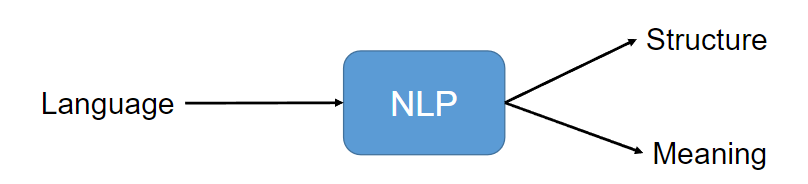
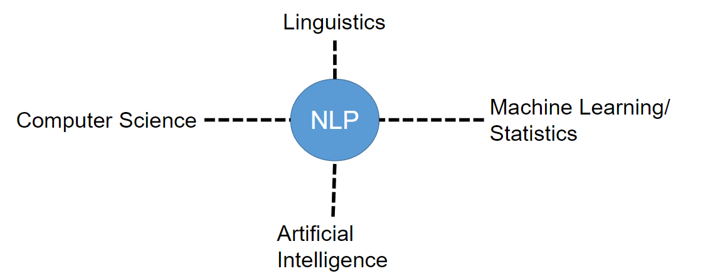

# Advance Natural Language Processing

## Lecture 1

    What is NLP?
        Natural-language processing (NLP) is a field of computer science, artificial intelligence that deals with the interactions between computers and human  (natural) languages, and
        particularly concerned with programming computers to fruitfully process large natural language data.
    
    What are its goals?
        Develop methods for processing, analysing and understanding the  structure and meaning of language.

        

    What are the applications of NLP?
        NLP is applied to build systems that help people do stuff using natural language.
        some of the applied nlp applications are as follows:
            1. Search
            2. Chat bots: Question Answering
            3. Translation
            4. Sentiment Analysis
            5. Speech Recognition
            6. Advertisement Matching
            7. Virtual Assistants
            8. Critique
            9. Summarization
            10. Reading Comprehension
            11. Text Classification

    Types or levels of Analysis in NLP:
        1. Phonology: Analysis of sounds/pronunciations that make up the language.
        2. Morphology: Analysis of the internal structure of the words.
        3. Syntax: Analysis of structure of the phrases.
        4. Semantic: Analysis of meaning of the language in real world.
        5. Discourse: Analysis of relations between clauses and sentences.

    What is language?
        A form of communications created/Invented by humans that evolved with culture and customs.
        It was reiterated and learned with experience.

    Why is language important?
        Language is important because it help convey and record data/information.
        It is encoded using multiple means like Sounds, Gestures and Images(writing).
        The process of encoding and decoding it in brain is of continuous nature.

    Why is it hard for computers to learn a language?
        Computer is a dumb device and has to instructed to do tasks but due to the complexity of the language it is quite hard for the computer to understand language even if it is programmed to do so, there are 4 factors that hinder Natural Language understanding for computer that is as follows:
        1. Ambiguity
        2. Variability
        3. Sparsity
        4. Grounding

    Ambiguity
        Ambiguity in Natural Language Processing (NLP) refers to the presence of multiple possible meanings or interpretations of a word, phrase, sentence, or text. This uncertainty can arise
        from various sources, there are multiple types of Ambiguity that are as follows:
            1. Lexical Ambiguity: A word belongs to two or more-words (“part of speech”) classes. or Words with multiple meanings
                Example: (e.g., "bank" can be a financial institution or a riverbank).
                        - Bank: financial institution or riverbank?
                        - Spring: season or coiled metal object?
                        - Cloud: weather phenomenon or data storage?

            1. Syntactic Ambiguity: Sentences with multiple possible parses.
                Example: (e.g., "The dog bit the man with the hat" can be parsed in different ways)
                - "The dog bit the man with the hat.": Did the dog bite the man who was wearing a hat, or did the dog bite the man using a hat as a tool?
                - "The teacher saw the student with the telescope.": Did the teacher see the student who was using a telescope, or did the teacher see the student while using a telescope?

            2. Structural Ambiguity: Sentences with multiple possible structures.
                Example: (e.g., "The man saw the woman with the telescope" can be structured in different ways)
                - "The man saw the woman with the child and the dog.": Did the man see the woman who was with the child and the dog, or did the man see the woman and the child, and also see the dog separately?
                - "The book on the table is mine.": Is the book on the table, or is the book about the table?

            3. Semantic Ambiguity: Words or phrases with multiple possible interpretations.
                Example: (e.g., "I'm feeling under the weather" can mean feeling sick or being outside)
                - "I'm feeling under the weather.": Am I feeling sick, or am I standing outside in the rain?
                - "Break a leg!": Is this a wish for good luck, or a literal instruction to injure oneself?

    Variability:
        Language is constantly evolving, with new words, expressions, and usage emerging (e.g., slang, idioms, and colloquialisms).
                Variability refers to the many ways people express the same idea or concept. For example:
                 - Different words for the same thing: "Soda", "pop", "coke", or "soft drink" can all refer to a carbonated beverage.
                 - Idioms and colloquialisms: "Break a leg!" means "good luck", while "cost an arm and a leg" means something is expensive.
                 - Regional dialects: People from different regions may use different words, phrases, or pronunciations to express the same idea.

    Sparsity: 
        The vastness of language, making it difficult to collect and process sufficient data to cover all possible linguistic variations.
        Sparsity refers to the vastness of language, making it difficult to collect and process sufficient data to cover all possible linguistic variations. For example:

           - Rare words: Many words are used infrequently, making it challenging to gather enough data to understand their meanings and usage.
           - Domain-specific language: Different fields, such as medicine or law, have their own specialized vocabulary and terminology.
           - Emerging language: New words, phrases, and expressions are constantly being created, making it hard to keep up with the latest linguistic trends.

    Grounding: 
        The challenge of connecting language to the physical world, requiring computers to understand the context and meaning behind words and phrases.
        Grounding refers to the challenge of connecting language to the physical world. For example:

           - Objects and entities: How do we define and identify objects, such as a "chair" or a "car", in the real world?
           - Actions and events: How do we describe and understand actions, such as "running" or "eating", in the context of the physical world?
           - Context and situation: How do we take into account the context and situation in which language is used, such as the location, time, and culture?

    Where NLP Lies?

        

    History:
        1990: corpus-based statistical methods
        2000s: rich structural formalisms
        2010s: representation learning with Neural Nets

## Lecture 2 and 3

    Eliza Application
        - ELIZA is an early natural language processing system that simulates a conversation with a user.
        - It imitates the responses of a Rogerian psychotherapist.
        - ELIZA uses pattern matching to recognize phrases and generate suitable outputs.
        - The program's simplicity and mimicry of human conversation led many to believe it truly understood their problems.

    Regular Expressions
        - Regular expressions (RE) are patterns used to match and manipulate text.
        - RE can be used to search, validate, and extract data from text.

        Anchors
          - ^ matches the start of a line or string.
          - $ matches the end of a line or string.
          - \b matches a word boundary (space, punctuation, or start/end of string).
          - \B matches a non-boundary (not a space, punctuation, or start/end of string).

        Quantifiers
          - {n} matches exactly n occurrences of the previous character or expression.
          - {n, m} matches at least n and at most m occurrences.
          - {n,} matches at least n occurrences.
          - * matches zero or more occurrences.
          - + matches one or more occurrences.
          - ? matches zero or one occurrence.

        Character Classes
          - [abc] matches any character in the set (e.g., "a", "b", or "c").
          - [^abc] matches any character not in the set (e.g., not "a", "b", or "c").
          - [a-zA-Z] matches any character in the range (e.g., any letter).
          - \w matches any word character (alphanumeric plus underscore).
          - \W matches any non-word character.
          - \d matches any digit.
          - \D matches any non-digit.
          - \s matches any whitespace character (space, tab, newline).
          - \S matches any non-whitespace character.

        Groups and Alternation
          - ( ) groups characters or expressions for capturing or alternation.
          - | matches either the expression before or after the pipe.

        Special Characters
          - . matches any single character (except newline).
          - ? matches the preceding element zero or one time.
          - ! is not a special character in regex, but can be used in negative lookahead/lookbehind assertions.
          - \ is used to escape special characters or to denote special sequences (e.g., \n, \t).
          - ( and ) are used to group characters or expressions.
          - [ and ] are used to define character classes.
          - { and } are used to define quantifiers.

        Escape Sequences
            - \n matches a newline character.
            - \t matches a tab character.
            - \r matches a carriage return character.
            - \f matches a form feed character.
            - \v matches a vertical tab character.
            - \\ matches a backslash character.
            - \" matches a double quote character.
            - \' matches a single quote character.

        Logical Operators
            - | (pipe) is used for alternation (OR).
            - (?=pattern) is a positive lookahead assertion (AND).
            - (?!pattern) is a negative lookahead assertion (NOT).
            - (?<=pattern) is a positive lookbehind assertion (AND).
            - (?<!pattern) is a negative lookbehind assertion (NOT).

        Errors
            - False positives (Type I): matching strings that should not be matched.
            - False negatives (Type II): not matching strings that should be matched.
            - Reducing error rates involves increasing accuracy (precision) and coverage (recall).

        Substitutions
          - To do substitutions, put parentheses ( ) around the first pattern and use the number operator \1 in the second pattern to refer back.
          - Example: s/([0-9]+)/<\1>/ will match and replace any sequence of digits with the same sequence surrounded by < and >.

        ELIZA Example
          - ELIZA is a simple chatbot that uses regular expressions to respond to user input.
          - ELIZA works by having a series of regular expression substitutions that match and change parts of the input lines.

        ELIZA Substitutions
          - The first substitutions change all instances of "my" to "YOUR", and "I'm" to "YOU ARE", and so on.
          - Example substitutions:
              - s/.* all .*/IN WHAT WAY/
              - s/.* always .*/CAN YOU THINK OF A SPECIFIC EXAMPLE/
              - s/.* I’[mM] (depressed|sad) .*/I AM SORRY TO HEAR YOU ARE \1/
              - s/.* I AM (depressed|sad) .*/WHY DO YOU THINK YOU ARE \1/

        Capture Groups
          - Capture groups are used to capture parts of the input text that can be referenced later in the substitution.
          - Example: s/(my|your) friend made (me|you) come here/\1 friend made \2 come here/
          - This substitution captures the words "my" or "your" and "me" or "you" and references them later in the substitution.

        Lookahead
          - Lookahead is a feature of regular expressions that allows you to check if a pattern matches without advancing the match cursor.
          - There are two types of lookahead: positive lookahead and negative lookahead.
          - Positive lookahead: (?=pattern)
          - Negative lookahead: (?!pattern)

        Negative Lookahead Example
          - Example: /(^?!Volcano)[A-Za-z]+/
          - This regular expression matches any single word that doesn't start with "Volcano" at the beginning of a line.

    Text Normalization

    Edit Distances

## Lecture 4

## Lecture 5

## Lecture 6
