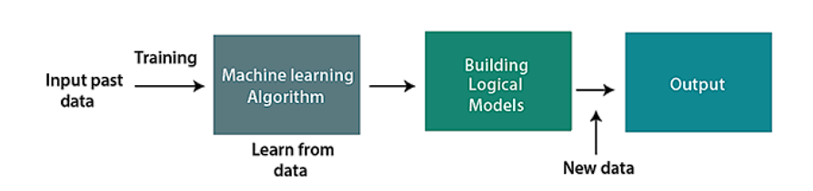
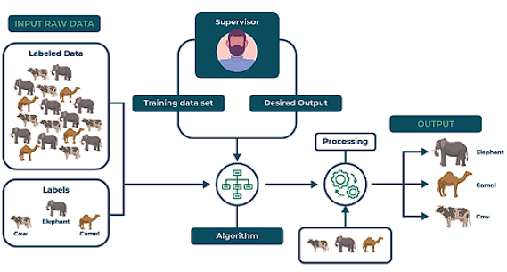
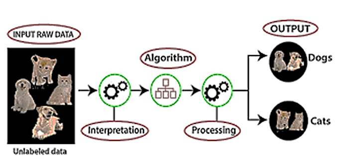

# Midterm Notes for ML

## Lecture 1

    What is machine learning?
    
        Machine Learning is a subset of Artificial Intelligence that is focused on the creation of algorithms.
        It enable a system to learn from data and previous experiences.
        In a nutshell we create a model, without explicit programming, which aids in making predictions or forecasting.

    

    Feature of ML:
        There are several features of Ml that are as follows:
            1. It can detect patterns in a given dataset.
            2. It can learn from previous encounter/data and improve automatically.
            3. It is data-driven Technology.
   
    Types of ML:
        There are 4 Types of ML that are as follows:
            1. Supervised ML

               1. Regression
                  1. Linear Regression: Predicts continuous outcomes using linear relationships.
                  2. Logistic Regression: Predicts binary outcomes using logistic functions.

               2. Classification

                  1. Linear
                     1. Logistic Regression: Classifies data using logistic functions.

                     2. Support Vector Machine: Classifies data using hyperplanes.

                  2. Non Linear
  
                     1. K-Nearest Neighbor (KNN): Classifies data based on nearest neighbors.
  
                     2. Kernel SVM: Classifies data using non-linear kernels.
  
                     3. Naive Bayes: Classifies data using Bayes' theorem.
  
                     4. Decision Tree: Classifies data using decision trees.
  
                     5. Random Forest: Classifies data using ensemble decision trees.

            2. Un Supervised ML

               1. Clustering: Groups similar data points into clusters.
               
               2. Association Rule: Discovers rules and patterns in data.
                  - Apriori: Generates association rules using Apriori algorithm.
                  - Eclat: Generates association rules using Eclat algorithm.
                  - F-P Growth: Generates association rules using F-P Growth algorithm.

            3. Semi Supervised ML  (Semi-supervised learning combines labeled and unlabeled data to improve model performance.)
               1. Self-Training: Trains a model on labeled data and then uses it to predict labels for unlabeled data.
               2. Co-Training: Trains two models on different views of the data and then uses them to predict labels for unlabeled data.
               3. Multi-View Learning: Trains a model on multiple views of the data to improve performance.
               4. Generative Models: Uses generative models such as Variational Autoencoders (VAEs) and Generative Adversarial Networks (GANs) to learn from unlabeled data.

            4. Reinforced ML (Reinforced learning involves training agents to make decisions based on rewards or penalties.)
               1. Q-Learning: Trains an agent to learn an optimal policy using Q-values.
               2. Deep Q-Networks (DQN): Trains an agent to learn an optimal policy using deep neural networks.
               3. Policy Gradient Methods: Trains an agent to learn an optimal policy using policy gradients.
               4. Actor-Critic Methods: Trains an agent to learn an optimal policy using actor-critic architectures.
               5. Model-Based Reinforcement Learning: Trains an agent to learn a model of the environment and then uses it to make decisions.

### Supervised ML

    How Does Supervised ML Classify?

        Supervised Machine Learning is when Labeled data is provided to the system for training, then based on the labeled training data some predictions are done as an output.
        Then the based on the training data a model is build which is later tested with unknown or fresh raw data to check its capability to accurately predict the correct output/label.

        

### Un Supervised ML

    How Does Un-Supervised ML Classify?

        Un-supervised Machine Learning is when unlabeled data is provided to the system for training, ut has to identify relations and patterns between the provided data and then has to group records/instances/data into the related or similar pattern groups.
        

### SemiSupervised ML

    How Does SemiSupervised ML Classify?

        SemiSupervised machine learning is a combination of both Supervised and unsupervised learning, the dataset has both labeled and unlabeled data, the labeled data is first train to create more datasets

### Reinforced ML

    How Does Reinforced ML Classify?

        Reinforced Machine Learning interacts with the environment by producing actions and discovering errors, it enhances itself using a reward or feedback to learn the behavior or the pattern.
        These can only be used in certain scenarios

#### Application of ML

    Supervised Learning:
        1. Image Classification: Identifies objects, faces, and features in images.
        2. Speech Recognition: Converts spoken language to text.
        3. Medical Diagnosis: Detects diseases and medical conditions.
        4. Email Spam Detection: Classifies emails as spam or not spam.
        5. Credit Scoring: Assesses the risk of a borrower defaulting on a loan.
        6. Weather Forecasting: Predicts temperature, humidity, and other weather parameters.
        7. Sentiment Analysis: Analyzes text to determine the sentiment or emotional tone.

    Un-supervised Learning:
        1. Clustering: Groups similar data points into clusters.
        2. Anomaly Detection: Identifies outliers or anomalies in data.
        3. Image Segmentation: Divides images into segments or regions of interest.
        4. Customer Segmentation: Groups customers based on their behavior and characteristics.
        5. Gene Expression Analysis: Analyzes gene expression data to identify patterns and correlations.
        6. Network Intrusion Detection: Identifies potential security threats in network data.
        7. Recommendation Systems: Recommends products or services based on user behavior and preferences.

    Semi-Supervised Learning:
        1. Image Classification and Object Recognition: Identifies objects and features in images with limited labeled data.
        2. Speech Recognition: Recognizes spoken language with limited labeled data.
        3. Natural Language Processing: Analyzes and processes human language with limited labeled data.
        4. Sentiment Analysis: Analyzes text to determine the sentiment or emotional tone with limited labeled data.
        5. Medical Diagnosis: Detects diseases and medical conditions with limited labeled data.
        6. Recommendation Systems: Recommends products or services based on user behavior and preferences with limited labeled data.
        7. Text Classification: Classifies text into categories with limited labeled data.

    Reinforced Learning:
        1. Game Playing: Trains agents to play games and make decisions.
        2. Robotics: Trains robots to perform tasks and make decisions.
        3. Autonomous Vehicles: Trains vehicles to drive and make decisions.
        4. Finance Trading: Trains agents to make trades and investment decisions.
        5. Supply Chain Optimization: Trains agents to optimize supply chain operations and make decisions.
        6. Personalized Recommendations: Trains agents to recommend products or services based on user behavior and preferences.
        7. Healthcare Treatment Planning: Trains agents to develop personalized treatment plans for patients.

## Lecture 2

## Lecture 3

## Lecture 4

## Lecture 5
